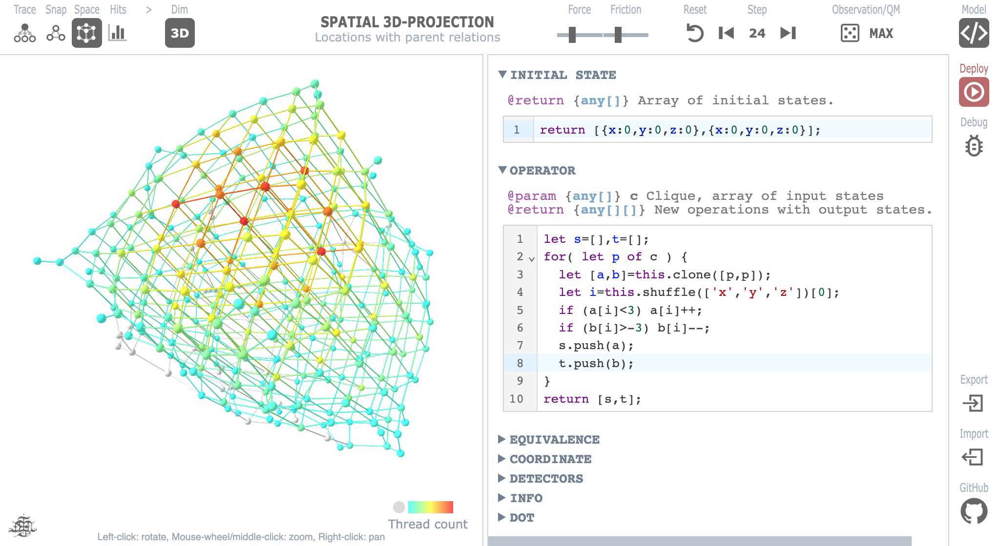
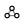
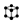
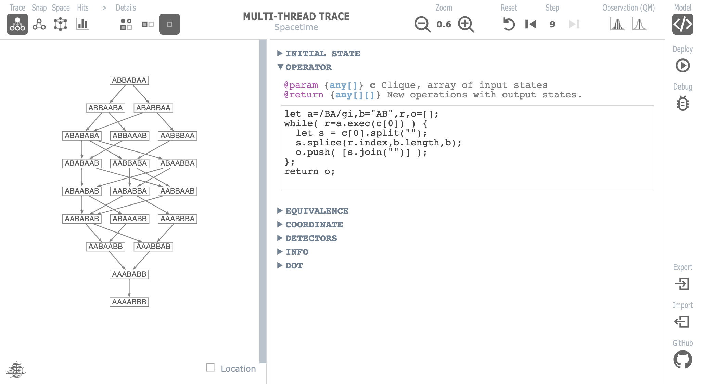
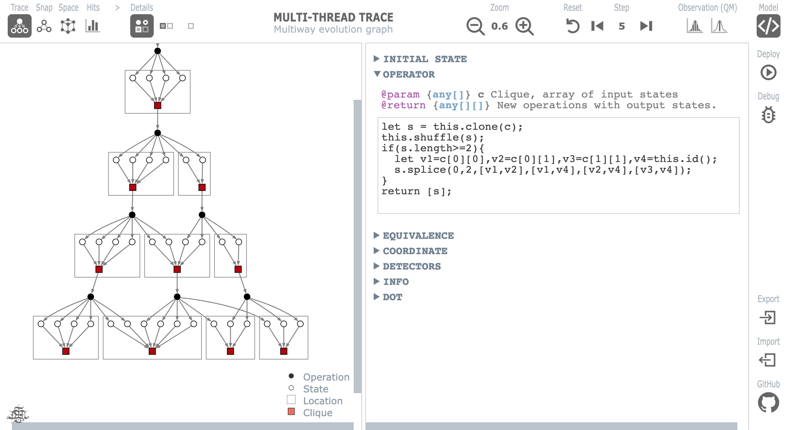
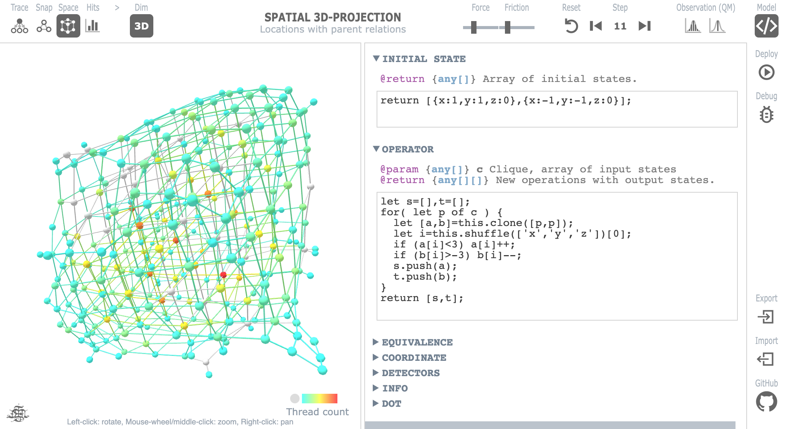

# CliqueVM

<br/>

**CliqueVM** is an experimental framework for building computational models,
both classical and quantum mechanical, and tracing their multithreaded
evolution as 2D/3D graphs. New models can be coded directly on the app
in JavaScript by modifying the operator function that maps a clique of states
into a new generation of states.

**Run online: https://met4citizen.github.io/CliqueVM/**

The purpose of the project is NOT to make an app for practical simulations,
but to study the underlying concepts and ideas.

The app uses [@hpcc-js/wasm](https://github.com/hpcc-systems/hpcc-js-wasm)
for compiling [Graphviz](https://graphviz.org) DOT language into SVG,
[3d Force-Directed Graph](https://github.com/vasturiano/3d-force-graph)
for rendering 3D graphs, [CodeMirror](https://codemirror.net) as a JavaScript
editor, and [KaTeX](https://katex.org) for displaying LaTeX notation.

The project is based on my two earlier projects
[Hypergraph](https://github.com/met4citizen/Hypergraph) and
[BigraphQM](https://github.com/met4citizen/BigraphQM).
For a philosophical take on these ideas read the blog post
[The Game of Algorithms](https://metacity.blogspot.com).


## Introduction

All physical systems evolve over time. We can represent this with
a mathematical object called an operator that maps the state of the system
at time $t$ into another state at $t+1$. When we call this operator
iteratively, we get a computational object called a program, a sequence
of operations acting on states.

Often the system has so many possible states that it is very hard or
impossible to describe the operator. Fortunately, all physical interactions
are, as far as we know, spacelike and local. This means that instead
of acting on the full state of the system we can process smaller collections
of microstates independently of each other. In our framework, we call these
collections cliques.

For two programs to end up spacelike and local, their computational
histories must be mutually consistent and they must compute the same function.
More specifically, their lowest common ancestors (LCAs) must be operations,
not states, and they have to belong to the same equivalence class
of programs. Both of these properties are relative. And when the relations
change, we end up with not one but multiple threads that can branch and
merge and run in parallel.

A multithreaded system, real or simulated, can be classical, quantum
mechanical, or some mix of the two depending on the operator. The thing
that makes a system quantum mechanical is the existence of superpositions.
A superposition is a situation in which some computational sequence $A$
is pairwise consistent with both $B$ and
$C$, but
$B$ and
$C$ are not consistent with each other. Graph-theoretically these are
called open triplets, second-order inconsistencies, that break local
classical states into two or more overlapping maximal cliques.

Once we know how to calculate these maximal cliques, we can use them as
inputs to our operator function, iterate the process, and trace the system's
multithreaded evolution with a pre-defined set of graph-based tools.
All this can be done within the app.

CliqueVM is called a framework, because it allows us to define, among others,
our own initial state, operator and equivalence relation. By using JavaScript's
primitive types, such as numbers, strings, arrays and objects, we can construct
hyperedges, vectors, complex numbers, matrices, coordinate systems etc.
Using these data structures as states, it is possible, at least in theory,
to build different types of rewriting systems, physical simulations
and other computational models.


## Theory

Let $H$ be a 3-partite directed acyclic graph (DAG) with the following
parts: operations $V_o$,
states $V_s$, and
maximal cliques $V_c$.

$\displaystyle\qquad H= (V_o \cup V_s \cup V_c, E),\quad E\subseteq (V_o{\times}V_s)\cup (V_s{\times}V_c)\cup (V_c{\times}V_o)$

At each new step, the latest set of maximal cliques, $L_c$, is used as an input
for the operator $\hat{M}$, which maps each clique into a new generation
of operations and output states.

$\displaystyle\qquad L_c=\big\lbrace v \in V_c\mid\mathbf{deg^+} (v)=0 \big\rbrace$

$\displaystyle\qquad \hat{M}: L_c\longrightarrow (V_o \cup V_s, V_o{\times}V_s)$

In order to calculate the new generation of maximal cliques, we start from
the latest operator-generated states $L_s$. Two states are local and spacelike
if and only if they are equivalent and their
[lowest common ancestors](https://en.wikipedia.org/wiki/Lowest_common_ancestor)
(LCAs) are operations. Let an undirected graph $G$ track all such pairs.

$\displaystyle\qquad L_s=\big\lbrace v \in V_s\mid\mathbf{deg^+} (v)=0 \big\rbrace$

$\displaystyle\qquad G= (L_s, E),\quad E = \big\lbrace (a,b)\mid a\sim b\wedge\mathbf{LCA}_H(a,b)\subset V_o\big\rbrace$

Now, let $\Omega$ be one of the disconnected subgraphs in
$G$. In order to find its maximal cliques, we use a variant of the
[Bron-Kerbosch algorithm](https://en.wikipedia.org/wiki/Bron–Kerbosch_algorithm).
The algorithm has the worst-case time complexity $O(3^{n\over 3})$ and for
[k-degenerate graphs](https://en.wikipedia.org/wiki/Degeneracy_%28graph_theory%29)
$O(kn3^\frac{k}{3})$.

$\displaystyle\qquad\mathcal{F} = \mathbf{BK}(\varnothing,\Omega,\varnothing)$

```
ALGORITHM BK(R, P, X) IS
    IF P and X are both empty THEN
        report R as a maximal clique
    choose a pivot vertex u in P ⋃ X
    FOR each vertex v in P \ N(u) DO
        BK(R ⋃ {v}, P ⋂ N(v), X ⋂ N(v))
        P := P \ {v}
        X := X ⋃ {v}
```

Once all the maxical cliques of all the disconnected subgraphs have been
calculated, a new iteration (step) can be started.

If the operator is deterministic, the system, too, is deterministic.
However, if the operator generates more that one operation, even
a deterministic system can become quantum mechanical. In these cases,
the evolution will appear probabilistic to any internal observer due
to self-locating uncertainty.

Under self-locating uncertainty, an observation becomes a process
in which the observer interacts locally in a way that resolves
all the second-order inconsistencies (superpositions). These
interactions make shortcuts through the ancestral structure. This
prevents certain future interactions, which appears to the observer
as a wave-function collapse.

From the internal observer's point of view, the proportion of all
the possible
[Hamiltonian paths](https://en.wikipedia.org/wiki/Hamiltonian_path)
that lead to the maximal clique $\mathcal{F_i}\in\mathcal{F}$ is
the probability $p_i$ of that outcome.

$\displaystyle\qquad p_i={{|\mathcal{F_i}|!}\over{\sum\limits_{j} |\mathcal{F_j}|!}},\quad i\in \lbrace 1,\dots,|\mathcal{F}| \rbrace$

Note that from the external point of view - from "the point of nowhere" - all
the possible interactions get actualised without any randomness or
probabilities. In this context, often called the Many-Worlds
interpretation, $p_i$ can be seen as the path weight.


## Graphs

The framework offers the following graph-based views:

VIEW | DESCRIPTION
:-: | :--
<sup>Trace</sup><br/> | Multithread trace views the evolution of the model as a full 3-partite directed acyclic graph (DAG).
<sup>Snap</sup><br/> | Snaphot of the trace at the current step. Snapshot is a hypersurface (foliation) of the multithreaded evolution.
<sup>Space</sup><br/> | Spatial 3D projection of the evolution. Each node represent a coordinate location and two location are connected with an undirected edge if one is a direct parent of the other.
<sup>Hits</sup><br/> | Detector hit counts as a bar chart.

Each of the views have options that lets the user filter out details.

The previous or the next step can be calculated by clicking the arrows next to
the `Step` indicator. `Reset` returns the model to its initial state.


## Models

By clicking `Model`, the user can specify his own model, deploy the model,
and export/import models as a JSON strings.

A model is a set of JavaScript functions:

The `INITIAL STATE` returns an array of initial states. A state can be
any valid JavaScript data structure.

An example:
```javascript
/**
/* @return {any[]} Array of initial states.
**/
return [1];
```

The `OPERATOR` gets a maximal clique (array of states) as its input
and returns an array of operations so that each operation is an array of
output states.

An example:
```javascript
/**
* @param {any[]} c Clique, array of input states
* @return {any[][]} New operations with output states.
**/
let sum = c.reduce((a,b)=>a+b,0);
let state1 = (2*sum+3) % 10;
let state2 = (3*sum+1) % 7;
let operation1 = [ state1, state2 ];
return [ operation1 ];
```

The `EQUIVALENCE` gets two states as its input and returns true, if the states
are equivalent (local), and false, if not.

An example:
```javascript
/**
* @param {any} s1 State 1
* @param {any} s2 State 2
* @return {boolean} True if the states are equivalent.
**/
return s1===s2;
```

The `COORDINATE` gets a state as its input and returns its coordinate label
as a string.

An example:
```javascript
/**
* @param {any} s State
* @return {string} Spatial coordinate.
**/
return s.toString();
```

The `DETECTORS` returns an array of states to be monitored. Whenever some
detector state is visited at some step, its counter is increased.

An example:
```javascript
/**
* @return {any[]} Detector states.
**/
return [0,1,2,3,4];
```

All functions get executed in strict mode with the "use strict" directive.

**NOTE:** The JavaScript source code in the JSON string is used to
create a new `Function` object. Unlike `eval()` the code is executed
in the global scope only, but it still suffers from many similar security
issues, so always check the model before importing!


## Model API

In order to keep functions short, the framework offers a simple API with
a set of commonly used utility functions and generators. All the API functions
are methods of a class `ModelAPI` and in the app they can be called
with `this`, for example: `this.id()`.

FUNCTION| DESCRIPTION
:-- | :--
<nobr>`id()`</nobr> | Returns a new unique number from [0,1,2,3...]. Reseting the model also resets the id counter.
<nobr>`clone(x)`</nobr> | Makes a deep copy of the given data structure (e.g. state).
<nobr>`shuffle(arr)`</nobr> | Shuffles an array in place using the Fisher-Yates shuffle.
<nobr>`comb(arr,[size])`</nobr> | Generates all combinations of a set. `size` is the length of the combination.<br/><br/>An example:<br/>`comb([a,b,c],2)` -> `[a,b] [a,c] [b,c]`
<nobr>`perm(arr,[size])`</nobr> | Generates all combinations of a set. `size` is the length of the permutation.<br/><br/>An example:<br/>`perm([a,b,c],2)` -> `[a,b] [a,c] [b,a] [b,c] [c,a] [c,b]`
<nobr>`cart(...sets)`</nobr> | Generates the cartesian product of the given sets.<br/><br/>An example:<br/>`cart([a,b],[c,d,e])` -> `[a,c] [a,d] [a,e] [b,c] [b,d] [b,e]`

**TODO:** Add utility functions for typical use cases such as graph and
string rewriting.


## Gallery

#### String rewriting BA->AB

<br/>

Copy the JSON string below and import it to the app:
```json
{"init":"return [\"ABBABAA\"];","oper":"let a=/BA/gi,b=\"AB\",r,o=[];\nwhile( r=a.exec(c[0]) ) {\n  let s = c[0].split(\"\");\n  s.splice(r.index,b.length,b);\n  o.push( [s.join(\"\")] );\n};\nreturn o;","eq":"return s1===s2;","coord":"return s;","detectors":"return [];"}
```

#### Single-way graph rewriting (1,2)(1,3)->(1,2)(1,4)(2,4)(3,4)

<br/>

Copy the JSON string below and import it to the app:
```json
{"init":"let v = this.id();\nreturn [[v,v],[v,v]];","oper":"let s = this.clone(c);\nthis.shuffle(s);\nif(s.length>=2){\n  let v1=c[0][0],v2=c[0][1],v3=c[1][1],v4=this.id();\n  s.splice(0,2,[v1,v2],[v1,v4],[v2,v4],[v3,v4]);\n}\nreturn [s];","eq":"return s1[0]===s2[0];","coord":"return s[0].toString();","detectors":"return [];"}
```

#### Two random walkers 3D

<br/>

Copy the JSON string below and import it to the app:
```json
{"init":"return [{x:0,y:0,z:0},{x:0,y:0,z:0}];","oper":"let s=[],t=[];\nfor( let p of c ) {\n  let [a,b]=this.clone([p,p]);\n  let i=this.shuffle(['x','y','z'])[0];\n  if (a[i]<3) a[i]++;\n  if (b[i]>-3) b[i]--;\n  s.push(a);\n  t.push(b);\n}\nreturn [s,t];","eq":"return s1.x===s2.x && s1.y===s2.y && s1.z===s2.z;","coord":"return s.x+','+s.y+','+s.z;","detectors":"return Array.from({length:7},(_,i)=>({x:i-3,y:0,z:0}));"}
```
